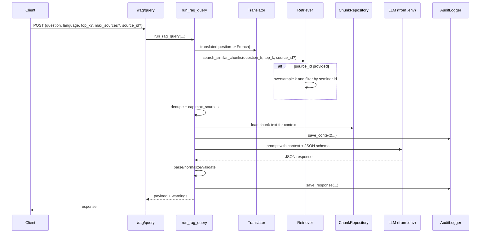

# Lacanian RAG API

RAG pipeline for Lacanian texts. It extracts and chunks PDFs, builds a FAISS
vector index with OpenAI embeddings, and exposes both a FastAPI service and a CLI
to run structured RAG queries with citations.

## Features

- PDF text extraction and chunking with page metadata
- FAISS index build/append with OpenAI embeddings
- RAG query flow with structured JSON responses
- FastAPI endpoints for query + incremental indexing
- CLI for interactive queries
- Audit logging of prompts and responses

## Project layout

- `app/application`: use cases (RAG, indexing)
- `app/infrastructure`: chunker, embeddings, FAISS index, OpenAI client, retriever
- `app/interfaces`: API, CLI, logging, verification tooling
- `data_pdfs/`: input PDFs (ignored in git)
- `text_chunks_json/`: chunked output (ignored in git)
- `vector_index/`: FAISS index and metadata (ignored in git)
- `rag_audit/`: audit logs (ignored in git)

## Requirements

- Python 3.10+
- OpenAI API key

## Install

```bash
python -m venv .venv
source .venv/bin/activate
pip install fastapi uvicorn pydantic python-dotenv openai PyPDF2 faiss-cpu numpy tqdm
```

```bash
pip install -r requirements.txt
```

## Configure

Set these environment variables (for example in `.env`):

- `OPENAI_API_KEY` (required)
- `OPENAI_GPT_MODEL` (default: `gpt-4o`)
- `OPENAI_TRANSLATION_MODEL` (default: `gpt-4o-mini`)
- `OPENAI_EMBEDDING_MODEL` (default: `text-embedding-3-large`)

Optional:

- `LOG_LEVEL` (default: `INFO`)
- `NO_COLOR` (disable colored logs when set)

## Build or update the index

You need a vector index before running queries. Use either approach:

### Batch build from PDFs

1. Place PDFs in `data_pdfs/` (filename becomes the seminar id).
2. Chunk PDFs:

```bash
python -m app.infrastructure.text_extractor
```

3. Build the FAISS index:

```bash
python -m app.infrastructure.embed_chunks
```

### Incremental indexing via API

The API can ingest a PDF, create chunks, and append embeddings:

```bash
curl -X POST http://127.0.0.1:8000/rag/index-text \
  -F "file=@data_pdfs/your.pdf" \
  -F "doc_id=seminar_xi"
```

## Run the API

The ASGI entrypoint is `api.py`.

```bash
uvicorn api:app --reload
# or
fastapi run api.py
```

Open `http://127.0.0.1:8000/docs` for Swagger UI.

### Query endpoint

```bash
curl -X POST http://127.0.0.1:8000/rag/query \
  -H "Content-Type: application/json" \
  -d '{"question":"What is the function of the gaze?","language":"en"}'
```

## RAG sequence flow



## CLI

```bash
python -m app.interfaces.cli
```

Follow the prompts for language selection and question text.

## Verify processed PDFs

```bash
python -m app.interfaces.verify
```

## Notes

- Index files live at `vector_index/lacan.index` and `vector_index/metadata.json`.
- Audit logs are stored in `rag_audit/` when audit is enabled (default).
- If the index or metadata files are missing, RAG queries will fail until the
  index is built or appended.
